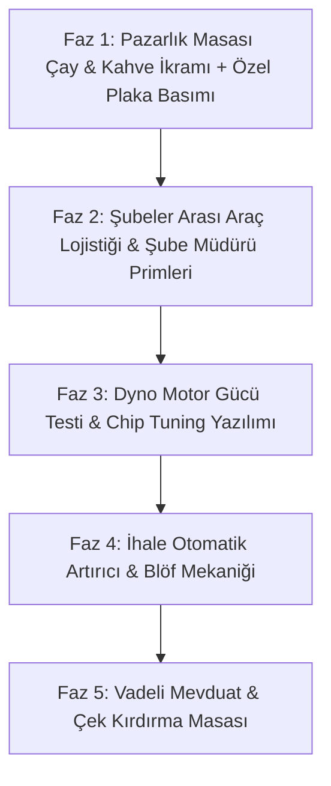

# GALERİSİNDEN — TÜM SERVİS, MODÜL VE FONKSİYONLARIN KAPSAMLI DENETİM VE GELİŞTİRME RAPORU

**Denetim Tarihi:** 18 Ağustos 2026  
**Kapsam:** Galerisinden v2.5.0 Tüm Sistemleri, 24 Ekran Modülü, 21 UseCase Engine'i, Veri Modelleri, Finansal Simülasyonlar ve Oyun Dinamikleri  
**Hazırlayan:** Baş Mimar & Sistem Denetçisi (Antigravity Orchestration Framework)

---

## 1. YÖNETİCİ ÖZETİ & SİSTEM GENEL DURUMU

Galerisinden projesinin kod tabanı, Riverpod tabanlı reaktif durum yönetimi, katmanlı Neo-Brutalist tasarım dili ve test odaklı mimari yapısıyla oldukça sağlam bir temele sahiptir. Toplam 260 birim ve widget testi %100 oranında (0 hata) başarıyla çalışmaktadır.

Yapılan bu 360 derecelik sistem denetiminde; oyunun 24 ana ekran ve alt servis modülü incelenmiş, her bir modülün mevcut çalışma kapasitesi, eksik kalan işlevleri ve oyuna derinlik katacak mikro/makro ölçekli geliştirme önerileri belirlenmiştir.

---

## 2. MODÜL VE SERVİS BAZLI DERİNLEMESİNE DENETİM MATRİSİ

### 1. 🔨 İhale Salonu (Auction System)
* **Mevcut Fonksiyonlar:** Canlı çekiç simülasyonu, 3 aşamalı çekiç sayacı, gümrük hacizli araçlar, bagaj piyangosu (Trunk Loot), rakip diyalogları ve çekilme tepkileri.
* **Tespit Edilen Eksikler:**
  - Teklif verirken son saniyelerde oyuncunun eli kaydığında aracı kaçırma riski yüksek.
  - Rakipler yapay zekayla agresifleşirken oyuncunun rakiplere psikolojik müdahale şansı yok.
* **Önerilen Mikro/Makro Geliştirmeler:**
  1. **Otomatik Teklif Robotu (Auto-Bidder Max Limit):** Oyuncunun maksimum tavan belirleyip otomatik teklif vermesi.
  2. **Gözdağı & Blöf Mekaniği (Psychological Intimidation):** Karizma yeteneğine bağlı olarak masaya yumruk vurma / blöf yapma butonu ile rakibi ihaleden kaçırma.

---

### 2. 🕵️‍♂️ Karaborsa & Kaçak Araçlar (Black Market)
* **Mevcut Fonksiyonlar:** İkiz plakalı, hacizli, kaçak gümrük araçları, polis baskını riski, aklama mekaniği.
* **Tespit Edilen Eksikler:**
  - Polis baskını anında oyuncunun pasif kalması ve tek yönlü ceza kesilmesi.
  - Araç aklamanın sadece sabit para ödemeyle tamamlanması.
* **Önerilen Mikro/Makro Geliştirmeler:**
  1. **Komiserle Diyalog & Rüşvet / Avukat Savunması:** Baskın geldiğinde 3 seçenek sunulması (Rüşvet teklif et, Hukuki itiraz yap, Aracı feda et).
  2. **Soğuk Damga & Şasi Numarası Çakma (Cold Stamping):** Atölyede şasi numarasını kazıyıp temiz hurda şasisiyle eşleştirme mini işlemi.

---

### 3. 🏢 Şubeleşme & Bayilikler (Branch System)
* **Mevcut Fonksiyonlar:** Kadıköy, Maslak, Etiler, Ankara, İzmir lokasyonları; şube müdürü atama; günlük pasif kâr.
* **Tespit Edilen Eksikler:**
  - Şubeler birbirinden bağımsız çalışıyor; merkez garajla şubeler arasında araç akışı yok.
  - Şube bazlı haftalık kâr/zarar ve ciro raporlaması eksik.
* **Önerilen Mikro/Makro Geliştirmeler:**
  1. **Şubeler Arası Çekici Transferi (Inter-Branch Logistics):** Ankara şubesinden ucuza alınan aracı Etiler VIP şubesine transfer edip 1.5x fiyata satabilme.
  2. **Şube Müdürü Hedef Primi:** Müdüre aylık kota koyma; kotayı tutturursa morale ve satış hızına +%25 buff.

---

### 4. 🧽 Oto Yıkama & Detailing (Car Wash)
* **Mevcut Fonksiyonlar:** Garaj araçlarını yıkama/parlatma, müşteri yıkama talepleri kuyruğu, dikiz aynası kokuları, far restorasyonu, jant demir tozu temizliği.
* **Tespit Edilen Eksikler:**
  - Yıkama ekipmanlarının (Basınçlı köpük makinesi, buhar jeneratörü) aşınma ve bakım gereksinimi yok.
* **Önerilen Mikro/Makro Geliştirmeler:**
  1. **Otomatik Tünel Yıkama Ünitesi Satın Alma:** Yüksek sermayeyle galeri önüne otomatik fırçasız tünel kurup dakikada 1 pasif müşteri yıkama geliri elde etme.
  2. **VIP Araç İçi Ozon Dezenfeksiyonu (₺600):** Sigara ve evcil hayvan kokularını sıfırlayan hızlı medikal dezenfeksiyon.

---

### 5. 🎖️ Karakter Gelişimi & Yetenek Ağacı (Character & Skills)
* **Mevcut Fonksiyonlar:** 6 temel yetenek (Pazarlık, Sezgi, Karizma, Usta Gözü, Finans, Bağlantılar), seviye ve XP kazanımı, başarımlar (Achievements).
* **Tespit Edilen Eksikler:**
  - Oyuncunun statik bir ismi var; oyundaki saygınlığını yansıtan aktif unvan/lakap sistemi yok.
* **Önerilen Mikro/Makro Geliştirmeler:**
  1. **Galerici Lakapları & Ünvan Sistemi:** *"Samanlık Kurdu"*, *"Oto Center Baronu"*, *"Halkın Esnafı"*, *"Kupon Koleksiyoncusu"*. Seçilen unvana göre özel pasif bonuslar (+%10 nakit pazarlık gücü vb.).
  2. **Günün Siftahı & Esnaf Duası Ritüeli:** Sabah ilk girişte kasaya siftah parası atıp gün boyu kritik şans buffı alma.

---

### 6. 🗺️ Şehir Haritası & Lokasyonlar (City Map)
* **Mevcut Fonksiyonlar:** 6 ana bölgeye hızlı geçiş (Oto Center, Sanayi, Noter, Bankalar, Lüks Galericiler, Gümrük).
* **Tespit Edilen Eksikler:**
  - Harita sadece statik bir menü görevi görüyor; hava durumu ve trafik olayları harita üzerinde hissedilmiyor.
* **Önerilen Mikro/Makro Geliştirmeler:**
  1. **Dinamik Bölgesel Olaylar (City Hotspots):** Örn: "Bugün Maslak Sanayi'de Çıkmacı Festivali var (%20 parça indirimi)", "Kadıköy Noteri'nde grev var (Satışlar %50 yavaş)".
  2. **Sarı Taksi & Makam Aracıyla Hızlı Ulaşım Animasyonu.**

---

### 7. 🤝 Konsinye Araç Satışı (Consignment System)
* **Mevcut Fonksiyonlar:** Sıfır sermaye ile müşteri araçlarını emanet alma, komisyonla vitrine koyma.
* **Tespit Edilen Eksikler:**
  - Araç sahibiyle iletişim tek seferlik kalıyor; zaman uzadığında müşteri sabırsızlığı dinamik işlemiyor.
* **Önerilen Mikro/Makro Geliştirmeler:**
  1. **Araç Sahibi Sabırsızlık Çağrıları:** 15 gün satılmayan konsinye araç için sahibinin arayıp "Arabamı geri ver veya fiyatı kır" baskısı yapması.
  2. **Emanet Araca Detailing Yapıp Komisyon Artırma:** Araç sahibine "Pasta cila yapıp liste fiyatını ₺50k artıralım, komisyonumu %5'ten %10'a çıkar" teklifi sunma.

---

### 8. 📊 Ana Merkez & Finansal HUD (Dashboard)
* **Mevcut Fonksiyonlar:** Bakiye, itibar, seviye, hava durumu, günlük özet, hızlı erişim çarkı, günlük gazete haberleri.
* **Tespit Edilen Eksikler:**
  - Kasa akış grafiği anlık gösteriliyor ancak geçmiş 30 günün gelir/gider trend eğrisi yok.
* **Önerilen Mikro/Makro Geliştirmeler:**
  1. **Mini Defter-i Kebir / Finansal Sağlık Skoru (A+ to F):** Galeri nakit akışını analiz eden anlık bilanço sağlığı göstergesi.
  2. **Ziyaretçi Sayacı & Günlük Galeri Trafik Analitiği.**

---

### 9. 🔍 Ekspertiz İstasyonu (Expertise System)
* **Mevcut Fonksiyonlar:** 5 aşamalı akıllı mühür motoru, dinamik eksper teknik değerlendirme raporu, boya/değişen kaporta grafiği, tramer ve şüpheli KM tespiti.
* **Tespit Edilen Eksikler:**
  - Ekspertiz işlemi tek seferde yapılıyor; oyuncu dilerse bağımsız "Dyno Motor Gücü Testi" veya "Yanal Kayma & Alt Takım Kontrolü" gibi alt testleri ayrı ayrı yaptıramıyor.
* **Önerilen Mikro/Makro Geliştirmeler:**
  1. **Dyno Beygir Gücü (HP / Tork) Ölçüm Grafiği:** Motorun fabrika çıkış beygiri ile güncel beygiri arasındaki kayıp yüzdesini görselleştiren kadran.
  2. **Ekspertiz Paketi Seçimi:** *Ekonomik (Sadece Kaporta ₺750)*, *Standart (Mekanik + Kaporta ₺1.800)*, *Full VIP Ekspertiz (Dyno + Airbag + Beyin ₺3.500)*.

---

### 10. 💳 Finans, Krediler, Senetler & Çekler (Finance System)
* **Mevcut Fonksiyonlar:** Banka kredileri, senetli taksit portföyü, vadeli müşteri çekleri, faiz oranları.
* **Tespit Edilen Eksikler:**
  - Vadesi gelmemiş çekleri acil nakit ihtiyacında bozdurma imkanı yok.
  - Karşılıksız çıkan senetlerin tahsilat takibi otomatik düşüyor.
* **Önerilen Mikro/Makro Geliştirmeler:**
  1. **Faktoring / Çek Kırdırma Masası:** Vadesine 20 gün kalan ₺200.000'lik müşteri çekini %8 iskonto ile anında ₺184.000 nakde çevirebilme.
  2. **Hukuk Bürosu & İcra Takibi:** Ödenmeyen senetleri avukata verip faiziyle icradan tahsil etme süreci.

---

### 11. 📰 Sanayi Dedikoduları & Piyasa Söylentileri (Gossip System)
* **Mevcut Fonksiyonlar:** Günlük rastgele söylentiler, piyasa trend manipülasyonları.
* **Tespit Edilen Eksikler:**
  - Oyuncu dedikoduları sadece okuyor; piyasaya bizzat dedikodu salamıyor.
* **Önerilen Mikro/Makro Geliştirmeler:**
  1. **Sanayiye Dedikodu Yayma (Market Whisperer):** Kahvehanedeki çırağa ₺2.000 verip "Dizel sedanlara ÖTV indirimi gelecekmiş" dedikodusu yayarak rakiplerin fiyat kırmasını sağlama veya elindeki araçları primlendirme.

---

### 12. 📜 Defter-i Kebir & Satış Geçmişi (History System)
* **Mevcut Fonksiyonlar:** Satılan tüm araçların kâr/zarar kayıtları, alıcı isimleri ve işlem tarihleri.
* **Tespit Edilen Eksikler:**
  - Filtreleme yalnızca liste şeklinde; araç markasına veya kârlılık oranına göre istatistiksel pasta grafik yok.
* **Önerilen Mikro/Makro Geliştirmeler:**
  1. **En Çok Kazandıran Marka/Model İstatistiği:** "Bu ay en yüksek kârı %34 marjla Honda Civic sağladı" analiz paneli.
  2. **PDF / Muhasebe Çıktısı Paylaşım Butonu.**

---

### 13. 🛒 2. El Araç Pazarı (Marketplace)
* **Mevcut Fonksiyonlar:** Arama çubuğu, filtre çipleri, satıcı kişilikleri (Acil Nakitçi, Titiz Memur vb.), 5664 SMS sorgusu, çok yönlü sıralama (Fiyat, KM, ROI, Yıl), pazarlık masası.
* **Tespit Edilen Eksikler:**
  - İlanları favoriye ekleyip gün atlandığında fiyat takibi yapma özelliği.
* **Önerilen Mikro/Makro Geliştirmeler:**
  1. **Favori & Takip Listesi (Price Drop Tracker):** Favoriye alınan ilanda satıcı satamadıkça fiyat kırınca bildirim düşmesi.
  2. **Canlı Takas Teklifi Butonu:** İlandaki satıcıya doğrudan garajındaki aracı takas teklif etme.

---

### 14. 🌙 Gece Pazarı & Yeraltı Yarışları (Night Market)
* **Mevcut Fonksiyonlar:** Gece yarışları, araç bahisleri, gizli modifiye parçaları.
* **Tespit Edilen Eksikler:**
  - Yarışlar salt şans ve kondisyon hesaplamasına dayanıyor; mini etkileşim eksik.
* **Önerilen Mikro/Makro Geliştirmeler:**
  1. **Vites Atma & Reaksiyon Mini Oyunu (Gear Shift Minigame):** Doğru yeşil çizgide vitese basarak kazanma şansını %25 artırma.
  2. **Ruhsatına Yarış (Pink Slip Race):** Aracını ortaya koyup zengin rakibin aracına el koyma yüksek riskli düello.

---

### 15. 🔑 Araç Kiralama Filosu (Rent A Car)
* **Mevcut Fonksiyonlar:** Günlük kiralama sözleşmeleri, aktif araç takibi, düzenli kira geliri.
* **Tespit Edilen Eksikler:**
  - Kiraya verilen aracın kaza yapması veya kilometreyi aşması gibi operasyonel sürprizler yok.
* **Önerilen Mikro/Makro Geliştirmeler:**
  1. **Kiralık Araç Hasar & Ceza Tazminatı:** Araç döndüğünde trafikte radar cezası veya ufak sürtme varsa depozitodan kesinti yapma.
  2. **Dizi-Film Makam Aracı Kiralama:** Lüks araçlar için 3 günlük set kiralama kontratı (Normal kiranın 3 katı getiri).

---

### 16. ⭐ Müşteri Yorumları & İtibar (Customer Reviews)
* **Mevcut Fonksiyonlar:** Satış sonrası 1-5 yıldız müşteri puanlaması, yorum metinleri, itibar etkisi.
* **Tespit Edilen Eksikler:**
  - Oyuncu gelen yorumlara cevap yazamıyor.
* **Önerilen Mikro/Makro Geliştirmeler:**
  1. **Esnaf Cevabı Yazma:** Haksız 1 yıldıza "Bizde yamuk olmaz kardeşim, gel çayımızı iç telafi edelim" cevabı verip yıldızı 4'e çıkarma.
  2. **Sosyal Medya Fenomen Sponsorluğu:** Fenomene ₺15.000 verip galeri için övgü videosu çektirme (+15 İtibar Puanı).

---

### 17. 🚜 Hurpalık & Çıkma Parça (Scrapyard)
* **Mevcut Fonksiyonlar:** Hurda araç alımı, parçalama, envanterde çıkma parça tutma ve atölyede kullanma.
* **Tespit Edilen Eksikler:**
  - Hurda parçalamadan elde edilen fazla parçaları toplu olarak paraya çevirme butonu yok.
* **Önerilen Mikro/Makro Geliştirmeler:**
  1. **Sanayi Çıkmacısına Toptan Parça Satışı:** İhtiyaç fazlası kapı, far, şanzıman parçalarını tek tıkla toptan satma.
  2. **Hurda İçinde Gizli Hazine (Lost Treasure):** Hurda aracın zemin döşemesi altından antika para veya orijinal yedek anahtar bulma şansı.

---

### 18. 🏬 Showroom & Stoktaki Araçlar (Showroom)
* **Mevcut Fonksiyonlar:** 3 bantlı araç kartları, maliyet/kâr analiz kartı, hafta sonu flaş indirim kampanyası, toplu ilana koyma, doping ve vitrin başköşesi.
* **Tespit Edilen Eksikler:**
  - Vitrindeki araçların fiziksel yerleşim krokisi görsel olarak dizilemiyor.
* **Önerilen Mikro/Makro Geliştirmeler:**
  1. **Fiziksel Showroom Kroki Düzeni (Drag & Drop Slots):** Vitrin Önü (Hero), Giriş Kapısı, İç Salon ve Otopark slotlarına araçları sürükleyerek dizme.
  2. **Araç Başına Özel Kampanya Pankartı Asma:** *"Öğretmenden Kelepir"*, *"Faizsiz Taksitli"* afişleri asma.

---

### 19. ☕ Yan Gelirler & İştirakler (Side Businesses)
* **Mevcut Fonksiyonlar:** Katlı Otopark, Çekici Filosu, Sanayi Tostçusu, Sigorta Acentesi yatırımları.
* **Tespit Edilen Eksikler:**
  - İştirakler kademe kademe geliştirilemiyor (Seviye 1'de kalıyor).
* **Önerilen Mikro/Makro Geliştirmeler:**
  1. **İştirak Seviye Atlama (Upgrades):** Çay Ocağı -> Lüks Cafe Bistro (Gelir x3), Çekici -> 3 Araçlı Filo (Kaza yapan araçları ilk görme hakkı).
  2. **Kendi Sattığın Araçlara Kasko / Sigorta Kesme:** Galeri müşterilerine anında kasko poliçesi satıp ek prim geliri kazanma.

---

### 20. 👥 Personel & Ekip Yönetimi (Staff Management)
* **Mevcut Fonksiyonlar:** Satış Danışmanı, Baş Usta, Çırak, Yıkamacı, Güvenlik istihdamı; maaş ve moral sistemi; tost/çay ısmarlama.
* **Tespit Edilen Eksikler:**
  - Personelin kıdem ve deneyim kazandıkça seviye atlaması (Level Up) eksik.
* **Önerilen Mikro/Makro Geliştirmeler:**
  1. **Personel Terfi & Seviye Atlama (Staff Mastery):** Deneyim kazanan Çırağın Kalfaya, Kalfanın Usta'ya dönüşmesi.
  2. **Ayın Elemanı Ödülü:** Personele prim vererek tükenmişliği sıfırlama ve 7 gün boyunca %150 verimlilik alma.

---

### 21. 📈 Borsa, Altın & Döviz (Stock Market)
* **Mevcut Fonksiyonlar:** Otomotiv hisseleri, Gram Altın, Dolar/Euro döviz alım-satımı, dinamik fiyat eğrileri.
* **Tespit Edilen Eksikler:**
  - Nakit parayı gecelik faize / mevduata yatırma seçeneği yok.
* **Önerilen Mikro/Makro Geliştirmeler:**
  1. **Vadeli Mevduat & Fon Hesabı:** Boşta duran nakit parayı 7-30 günlük banka mevduatına bağlayıp risksiz getiri sağlama.
  2. **Hisse Senedi Temettü Dağıtımı:** Elde tutulan otomotiv fabrikası hisselerinden her ay temettü geliri alma.

---

### 22. 🛠️ Tamir, Kaporta & Tuning Stüdyosu (Workshop)
* **Mevcut Fonksiyonlar:** 10.000 KM periyodik bakım, parça değişimi, fırın boya, özel renk değişimi, PDR boyasız göçük düzeltme, TÜVTÜRK muayenesi, müşteri tamir sözleşmeleri, stage tuning, coilover, egzoz ve jant modifiyesi.
* **Tespit Edilen Eksikler:**
  - Modifiye ve tuning yapılmış araçların vitrinde genç alıcılara özel filtreleme alanı.
* **Önerilen Mikro/Makro Geliştirmeler:**
  1. **Yazılım & Chip Tuning (Stage 1 / Stage 2 ECU Remap):** Motor gücünü +%25 artırıp sokak yarışı ve genç müşteri değerini katlama.
  2. **Cam Filmi & Bodykit Montajı:** ₺1.200 maliyetle araca agresif tampon ve spoiler takıp vitrinde hızlı müşteri çekme.

---

### 23. ⚙️ Ayarlar & Tema Paletleri (Settings)
* **Mevcut Fonksiyonlar:** Ses/Müzik seviyesi, Haptik titreşim, Tema seçimi (Dark/Light Neo-Brutal).
* **Tespit Edilen Eksikler:**
  - Veri yedekleme (JSON Export / Import) fonksiyonu.
* **Önerilen Geliştirmeler:**
  1. **Bulut / Yerel Oyun Kaydı Dışa/İçe Aktarma:** Oyuncunun kariyerini tek tıkla JSON olarak kopyalayıp yedekleyebilmesi.

---

### 24. 🤝 Pazarlık Masası & Çay İkramı (Negotiation Screen)
* **Mevcut Fonksiyonlar:** Müşteri sabır ve inat çubukları, çoklu karşı teklif stratejileri, blöf ve karizma kullanımı.
* **Tespit Edilen Eksikler:**
  - Masada Türk esnaf kültürünün vazgeçilmezi olan sıcak içecek ikramı ile tansiyon düşürme aksiyonları eksik.
* **Önerilen Mikro Geliştirmeler:**
  1. **Tavşan Kanı Çay & Közde Kahve Ismarlama:** Pazarlık kilitlendiğinde ₺50'ye çay söyleyip müşterinin inat barını %20 düşürme, ₺150'ye okkalı Türk kahvesiyle güven tazeleme.
  2. **Özel Memleket & İsim Plakası Hediye Etme:** Müşterinin memleket plakasını (`06`, `34`, `61`, `35`) basıp el sıkışmayı garantileme.

---

## 3. ÖNCELİKLİ GELİŞTİRME YOL HARİTASI (ROADMAP)

Aşağıdaki fazlar oyunun dengesini, RPG derinliğini ve kullanıcı bağlılığını en üst seviyeye taşımak üzere önceliklendirilmiştir:

---

## 4. SONUÇ VE AKSİYON ÖNERİSİ

Galerisinden projesi, mevcut mimarisiyle Türkiye otomotiv galericilik kültürünü en ince detayına kadar simüle eden benzersiz bir oyundur. Yukarıda listelenen tüm sistem geliştirmeleri modüler olarak tasarlanmış olup, TDD metodolojisiyle adım adım hayata geçirilmeye hazırdır.

Hangi faz veya servisten başlanmasını isterseniz, ilgili servis için anında test paketleri yazılıp kodlama başlatılabilir.
